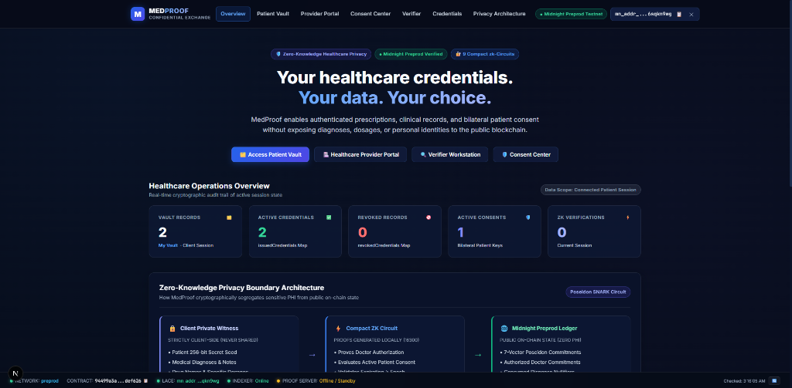
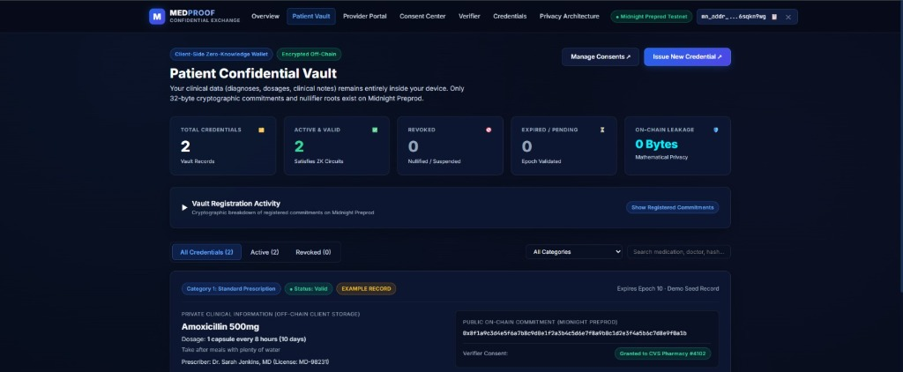

# 🏥 MedProof — Confidential Healthcare Credential & Consent Exchange

[](https://github.com/shouvik7majumdar/healthcare-credential/actions/workflows/ci.yml)
[](https://midnight.network)
[](https://midnight.network)
[](https://midnight.network)
[](https://medproof-ashen.vercel.app/)
[](https://opensource.org/licenses/MIT)

**MedProof** is a production-grade, privacy-preserving healthcare credential and consent exchange built on the **Midnight Network** using **Compact** smart contracts and Zero-Knowledge proofs (zk-SNARKs). MedProof empowers patients, authorized healthcare prescribers, and licensed verifiers (pharmacies, insurers, research clinics) to issue, manage, consent to, and verify healthcare credentials without exposing sensitive Personal Health Information (PHI), diagnostic data, or patient/doctor identities on-chain.

<p align="center">
  <h3>LANDING PAGE</h3>
  
  <br />
  <i>MedProof Landing Page — Zero-Knowledge Healthcare Credential & Consent Exchange Overview.</i>
</p>

<p align="center">
  <h3>CONFIDENTIAL PATIENT VAULT</h3>
  
  <br />
  <i>Patient Confidential Vault interface for managing encrypted clinical prescriptions, inspecting zero-knowledge commitments, and controlling verifier consent permissions.</i>
</p>

---

## 🎥 Demo Video & Live Links

| Resource | Description | Status / Link |
| :--- | :--- | :--- |
| **🌐 Live Application** | Deployed web application on Vercel | [Live Demo](https://medproof-ashen.vercel.app/) |
| **🐦 X (Twitter) Account** | Official MedProof X (Twitter) Account | [@MedProof_midnit](https://x.com/MedProof_midnit) |
| **🐙 GitHub Repository** | Open-source monorepo codebase | [GitHub Repo](https://github.com/shouvik7majumdar/healthcare-credential) |
| **🎥 Demo Video** | Interactive application walkthrough | [Watch Demo Video (YouTube)](https://youtu.be/-8m0TcUsUUc) |
| **⚙️ CI/CD Workflow** | GitHub Actions build & verification pipeline | [View CI/CD Pipeline](https://github.com/shouvik7majumdar/healthcare-credential/actions/workflows/ci.yml) |
| **🔍 NightScan Explorer** | Midnight Preprod Network Explorer | [Midnight Preprod Explorer](https://explorer.preprod.midnight.network/) |
| **📄 Product Proposal** | Complete project documentation and specs | [PROPOSAL.md](PROPOSAL.md) |

---

## 📌 Verified Preprod Deployment & Provenance

The canonical MedProof smart contract (`medproof.compact`) is deployed and actively verified on the **Midnight Preprod Network**:

| Field | Details / Authoritative On-Chain Record |
| :--- | :--- |
| **Target Network** | Midnight Preprod Network (Network ID: `preprod`) |
| **Smart Contract Address** | `94499aa3a15d5818967c5d8acc562daa1656ca07eb873cdfd4eca50d681def626` |
| **Deployment Transaction Hash** | `0329c0bad4d3e396b90a939343bdd2f674aec5f7f0cec6fde35e754b0a75c435` |
| **Deployment Block Height** | `#2621646` |
| **Node RPC Endpoint** | `https://rpc.preprod.midnight.network` |
| **Indexer GraphQL API** | `https://indexer.preprod.midnight.network/api/v4/graphql` |
| **Indexer WebSocket** | `wss://indexer.preprod.midnight.network/api/v4/graphql/ws` |
| **Proof Server Engine** | Midnight Proof Server `v8.1.0` (`http://127.0.0.1:6300`) |

### Cryptographic Domain Consistency
All commitments, nullifiers, and consent records are derived using Midnight's native Poseidon hash primitives:
- **Patient Commitment**: `Poseidon(patientSecret, pad(32, "PATIENT_ID"))`
- **Credential Commitment**: `Poseidon(disclosedIssuerCommitment, patientCommitment, schemaHash, categoryHash, epochHash, payloadHash, salt)`
- **Consent Identifier**: `Poseidon(patientSecret, verifierPk, credentialCommitment, pad(32, "MEDPROOF_CONSENT"))`
- **Verification Nullifier (Single-Use Dispense)**: `Poseidon(patientSecret, commitment, pad(32, "DISPENSE"), epochHash)`
- **Verification Receipt**: `Poseidon(commitment, verifierPk, sessionNonce, pad(32, "RECEIPT"))`

---

## 🔒 Cryptographic Architecture & Privacy Guarantees

In MedProof, all clinical health data and personal identifiers are strictly partitioned into **Client-Side Private Witness State** and **On-Chain Public Ledger State**.

### Client-Side Private Witness State (Never Disclosed)
1. **Patient Secret (`patientSecret`)**: A 256-bit entropy seed known solely to the patient, used locally to derive patient commitments, consent identifiers, and cryptographic nullifiers.
2. **Clinical Content & PHI**: Diagnoses, medication names, dosages, instructions, and clinical notes remain strictly inside client-side storage.
3. **Salts & Nonces**: Cryptographic nonces that prevent dictionary and rainbow-table attacks against registered commitments.
4. **Consent Pre-images**: Verifier authorization inputs evaluated locally inside the Midnight ZK prover engine.

### On-Chain Public Ledger State (Transparent & Verifiable)
1. **`totalCredentialsIssued`**: Monotonically increasing counter of registered credential commitments on Preprod.
2. **`totalVerifications`**: Verified zero-knowledge proof execution counter on Preprod.
3. **`authorizedProviders`**: Ledger mapping of authorized healthcare provider public key commitments.
4. **`issuedCredentials`**: Ledger mapping of active credential commitments.
5. **`revokedCredentials`**: Ledger mapping of revoked credential commitments.
6. **`activeConsents`**: Ledger mapping of active bilateral patient-to-verifier consent identifiers.
7. **`nullifiers`**: Ledger mapping of consumed dispense nullifiers preventing double-dispensing.

---

## 🏗️ System Architecture

MedProof is organized as an enterprise monorepo:

```text
healthcare-credential/
├── contracts/                  # Midnight Compact smart contract workspace
│   ├── medproof.compact        # Production Compact contract with 9 ZK circuits
│   └── managed/medproof/       # Compiled ZK circuit artifacts & TypeScript bindings
├── ui/                         # Next.js 15 App Router web application
│   ├── src/app/                # 7 Healthcare portals (/patient, /provider, /consent, etc.)
│   ├── src/services/           # Lace Wallet integration & Midnight contract services
│   ├── src/context/            # Shared reactive application state
│   └── src/lib/config.ts       # Canonical Preprod network configuration
├── src/                        # Deployment, wallet, and CLI utilities
├── scripts/                    # Verified lifecycle & verification scripts
├── tests/                      # 119 unit and integration tests (Vitest)
├── docs/images/                # Visual assets and UI screenshots
└── vercel.json                 # Vercel production deployment configuration
```

### Full-Stack Healthcare Portals
- **Patient Vault (`/patient`)**: Patients manage credentials, inspect private details, and grant time-bounded consent.
- **Provider Portal (`/provider`)**: Verified prescribers issue tamper-proof cryptographic credentials.
- **Consent Center (`/consent`)**: Granular consent authorization and revocation management.
- **Verifier Portal (`/verifier`)**: Pharmacies, insurers, and clinical research teams verify credentials with zero PHI disclosure.
- **Credential Explorer (`/credentials`)**: Public on-chain commitment audit trail.
- **Privacy Architecture (`/privacy`)**: Interactive breakdown of private witnesses vs public state.

---

## 👛 Midnight Lace Wallet Integration

The application integrates natively with the official **Midnight Lace Browser Wallet** via the DApp Connector standard (`window.midnight.mnLace`):

1. **Auto-Detection & Handshake**: Probes for the Lace extension and handles locked, disconnected, or missing provider states gracefully.
2. **Access Authorization**: Requests read permissions for the user's Midnight Preprod address via `connect('preprod')`.
3. **Resilient Session Management**: Incorporates non-fatal readiness retries, bounded lock detection, and extension channel shutdown recovery.
4. **On-Chain ZK Proof Transactions**: Executes zero-knowledge transactions on Midnight Preprod with real tNIGHT balances and DUST fee management.

---

## 🧪 Automated Testing

MedProof features a 100% passing test suite with **119 automated tests across 12 test files**:

```bash
npm test
```

### Verification Results

```text
 ✓ tests/lace-connection-optimization.test.ts (6 tests)
 ✓ tests/lace-session-robustness.test.ts (10 tests)
 ✓ tests/lace-fast-reconnect.test.ts (5 tests)
 ✓ tests/phase6c-grant-consent.test.ts (6 tests)
 ✓ tests/phase9r-domain-repair.test.ts (6 tests)
 ✓ tests/healthcare.test.ts (9 tests)
 ✓ tests/privacy.test.ts (7 tests)
 ✓ tests/contract.test.ts (9 tests)
 ✓ tests/network.test.ts (5 tests)
 ✓ tests/level4-ux-upgrade.test.ts (16 tests)
 ✓ tests/ui-nextjs-integration.test.ts (26 tests)
 ✓ tests/medproof-contract.test.ts (14 tests)

 Test Files  12 passed (12)
      Tests  119 passed (119)
```

---

## 🚀 Local Development Setup

### Prerequisites
- **Node.js**: `>=20.0.0` or `22.x`
- **npm**: `>=10.x`
- **Docker**: For local Midnight Proof Server (`midnightntwrk/proof-server:8.1.0`)
- **Midnight Lace Extension**: Configured for Midnight Preprod Network

### Steps
```bash
# 1. Clone & install dependencies
git clone https://github.com/shouvik7majumdar/healthcare-credential.git
cd healthcare-credential
npm install && cd ui && npm install && cd ..

# 2. Start local Proof Server
docker run -d -p 6300:6300 midnightntwrk/proof-server:8.1.0

# 3. Run test suite
npm test

# 4. Build Next.js production bundle
cd ui && npm run build

# 5. Start development server
npm run dev:ui
```
Open `http://localhost:3000` to interact with the MedProof application.

---

## 📜 License

This project is licensed under the **MIT License** - see the [LICENSE](LICENSE) file for details.
