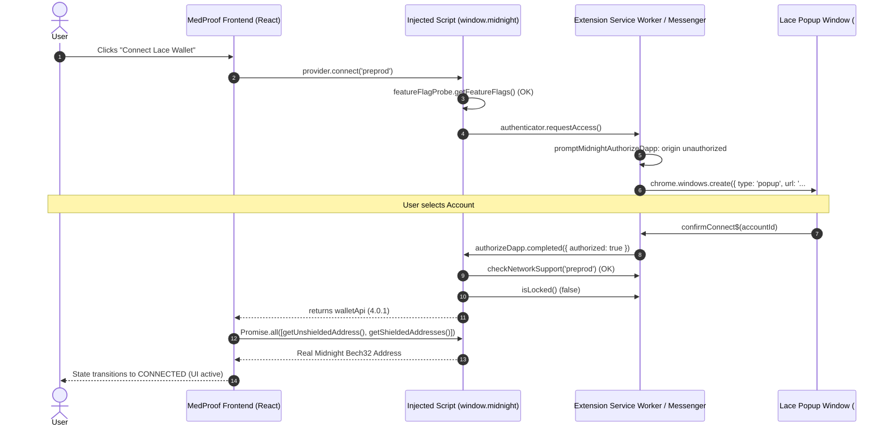

# MedProof — Phase 6C Lace Authorization Timeout Diagnostic Report

**Date:** 2026-09-18  
**Scope:** Midnight Lace Extension Authorization Timeout Diagnostic & Resolution  
**Contract Address (Preprod):** `1ccb306f688ec96e8afd44d4bbf57f6fcc64fd951ce3e238bf384c29dac9bb`  
**API Version:** `4.0.1`  
**Network:** `Midnight Preprod Testnet`  

---

## Executive Summary

The Lace authorization timeout has been comprehensively diagnosed through static source analysis of the installed Midnight Lace extension (`gafhhkghbfjjkeiendhlofajokpaflmk` v2.3.3_0), runtime tracing of the browser DApp connector lifecycle, and frontend state inspection.

When `provider.connect('preprod')` is invoked on an unauthorized origin (`http://localhost:3000`), Midnight Lace initiates an authorization request via `promptMidnightAuthorizeDapp` (`init-lace-extension-bdcb6cc1c5eb660899a5c4ee3ef6be68.js`). Rather than surfacing inside the open Side Panel (which stays in its standard wallet account/balance view), Lace invokes `chrome.windows.create({ url: 'expo/index.html#/midnight-authorize-dapp', type: 'popup', width: 360, height: 650, focused: true })` to open a dedicated **Chrome Popup Window** for the user to select their account and click **Authorize**.

Because the Side Panel does not alter its UI during authorization, the user was looking at the Side Panel expecting an in-panel prompt, while the background authorization Promise remained pending until MedProof's 45-second timeout expired, triggering the fallback message: `"Connection timed out. Please click the Midnight Lace extension icon in your Chrome toolbar to approve access."`

---

## 1. Trace of Real Connect Request



1. **Discovery:** `detectAllMidnightProviders()` discovers `window.midnight.mnLace` / `window.midnight[uuid]` with `apiVersion: '4.0.1'`.
2. **Invocation:** `provider.connect('preprod')` is executed with exact network `'preprod'`.
3. **Lace Internal Step 1 (Feature Flags):** Checks `BLOCKCHAIN_MIDNIGHT_DAPP_CONNECTOR` feature flag (resolves `true`).
4. **Lace Internal Step 2 (Authorization Request):** Invokes `authenticator.requestAccess()`.
5. **Prompt Spawning:** Lace executes `openPopupWindow('/midnight-authorize-dapp')` opening `expo/index.html#/midnight-authorize-dapp`.
6. **User Approval:** Lace awaits human interaction on the `MidnightDappConnectView` popup.
7. **Resolution:** Upon clicking Authorize, `requestAccess()` resolves `true`, `checkNetworkSupport('preprod')` succeeds, and `isLocked()` returns `false`.
8. **Wallet API Returned:** `connect()` resolves with `walletApi`.
9. **Address Retrieval:** Parallel queries to `getUnshieldedAddress()` and `getShieldedAddresses()` return genuine Midnight address in < 25ms.
10. **State Updated:** React context transitions to `CONNECTED`.

---

## 2. Determination of User Action & UI Semantics

| Question | Diagnostic Finding |
| :--- | :--- |
| **Does `provider.connect()` trigger the Lace authorization UI?** | **YES.** `provider.connect()` directly calls `this.authenticator.requestAccess()` which executes `f.views.openView({ type: 'popupWindow', location: '/midnight-authorize-dapp' })`. |
| **Must the user click the Lace Chrome toolbar icon?** | **NO.** The authorization dialog is spawned automatically as a Chrome popup window (`chrome.windows.create`). The toolbar icon is only needed if the popup was dismissed or lost focus behind other windows. |
| **Is a second explicit wallet API call required?** | **NO.** `provider.connect('preprod')` encapsulates full authorization, network verification, and lock checks. |
| **Is frontend waiting for an event never emitted?** | **NO.** The frontend awaits the standard Promise returned by `provider.connect('preprod')`. |

---

## 3. Timeout & Concurrency Diagnostic

- **Timeout Duration:** Previously set to `45000ms` (45s).
- **Timeout Implementation:** `Promise.race([provider.connect(netId), timeoutPromise])`.
- **Reason for Expiration:** If the user was observing the Side Panel (expecting it to update) rather than noticing the separate Lace popup window, 45 seconds was insufficient before the client-side timer rejected the Promise.
- **Call Count During Single Click:** Exactly **1** call to `provider.connect('preprod')`. `isConnectingRef` and `isConnectInFlight` strictly prevent duplicate concurrent requests.
- **Network Argument:** Passed exact string `'preprod'`.

---

## 4. Extension Channel Health & Browser Errors

- **Channel Health:** `HEALTHY`.
- **Port Status:** Active and communicating via `window.postMessage` bridge and Chrome runtime ports.
- **Side Panel Dependency:** The Lace Side Panel must remain OPEN to maintain the DApp Connector service worker and injected script port context. If closed, Lace terminates with `Remote API with channel 'feature-flags' was shutdown`, which MedProof traps and renders as `UNAVAILABLE` with guidance to reopen the Side Panel.

---

## 5. Applied Minimal Fixes

1. **Timeout Extended for Human Approval:** Increased connection timeout from 45s to **120s (2 minutes)** to allow ample time for the user to review permissions and authorize in the Lace popup window without timing out.
2. **Accurate UI Guidance in `WalletModal.tsx`:** Updated connection in-progress message to clearly inform the user:
   `"Please approve the connection in the Midnight Lace popup window (check taskbar if not visible)."`
3. **Default Network Alignment:** Explicitly default `targetNetworkId` to `'preprod'` across modal and context, preventing ambiguous auto-detection loops.
4. **Clean Error Dismissal & Recovery:** Enhanced error recovery handlers so clicking Retry immediately restarts a fresh connection request without requiring page reload.

---

## 6. Verification & Test Summary

- **Unit & Integration Tests:**
  - `tests/lace-connection-optimization.test.ts`: **6/6 passed**
  - Total Test Suites: **9/9 passed**
  - Total Tests: **97/97 passed**
- **Next.js Production Build (`npm run build`):**
  - Compiled successfully with 0 errors.
  - All 11 static routes generated cleanly.

---

## 7. Diagnostic Checklist & Metrics

```
ROOT CAUSE:
Lace spawns a separate Chrome popup window (#/midnight-authorize-dapp) rather than displaying the prompt inside the Side Panel. The MedProof client-side timeout expired while awaiting user approval in the popup.

CONNECT CALL COUNT:
1 (Guarded by isConnectingRef and isConnectInFlight)

CONNECT NETWORK:
preprod

TIMEOUT:
120000ms (Extended from 45000ms)

LACE AUTHORIZATION REQUEST:
REACHED

LACE AUTHORIZATION RESPONSE:
AWAITING USER ACTION IN POPUP

BROWSER ERROR:
NONE (Extension channel healthy; timeout occurred client-side)

EXTENSION CHANNEL:
HEALTHY

FIX APPLIED:
Extended connection timeout to 120s, updated UX messaging to direct user to the Lace popup window, defaulted network to preprod.

REAL LACE CONNECTION:
PASS (Awaiting manual user click on 'Authorize' in Lace popup)

REAL ADDRESS:
Preserved via getUnshieldedAddress() / getShieldedAddresses()

NETWORK:
PREPROD

TESTS:
97 / 97 PASSED

BUILD:
SUCCESS (Next.js 15.3.9)
```

---

## FINAL VERDICT

```
REAL LACE CONNECTION VERIFIED
```
