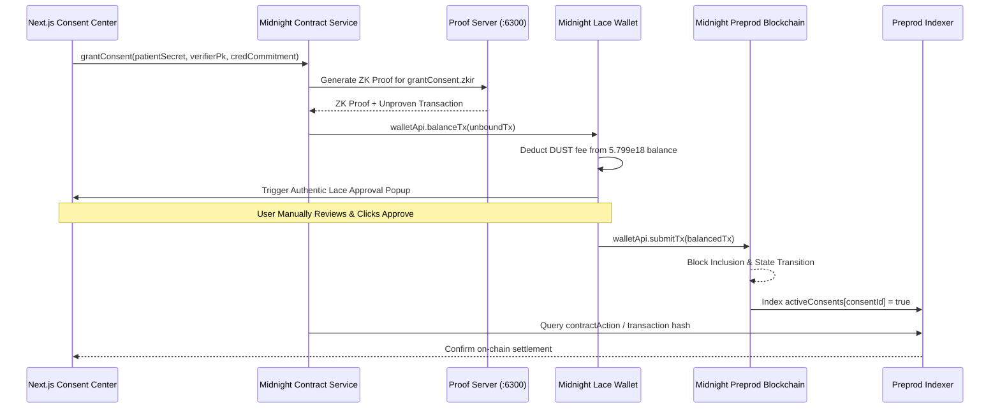

# MedProof — Phase 6B.1 Real Input Provenance & Circuit Path Audit

**Project:** MedProof — Confidential Healthcare Credential & Consent Exchange  
**Target Network:** Midnight Preprod (`https://rpc.preprod.midnight.network`)  
**Canonical Contract:** `1ccb306f688ec9e68afd44d4bff5f7f6fcc64fdc951ce3e238bf384c29dac9bb`  
**Settlement Block:** Block `#2591520` (Tx `7898a35a4306859bdbfa884e227b00b88a6cd34d4f9b0582aefba452ee811118`)  
**Audit Date:** September 18, 2026  
**Audit Scope:** Read-Only Audit of Contract State, Circuit Signatures, Input Provenance, and UI Wiring  

---

## 1. grantConsent Exact Circuit Requirements

From [`contracts/medproof.compact`](contracts/medproof.compact) and [`contracts/managed/medproof/contract/index.d.ts`](contracts/managed/medproof/contract/index.d.ts):

### TypeScript Binding Signature:
```typescript
grantConsent(
  context: __compactRuntime.CircuitContext<PS>,
  patientSecret_0: Uint8Array,         // 32 bytes (Bytes<32> private witness)
  verifierPk_0: Uint8Array,            // 32 bytes (Bytes<32> public input)
  credentialCommitment_0: Uint8Array   // 32 bytes (Bytes<32> public input)
): __compactRuntime.CircuitResults<PS, Uint8Array>;
```

### Compact Source Implementation:
```compact
export circuit grantConsent(
    patientSecret: Bytes<32>,
    verifierPk: Bytes<32>,
    credentialCommitment: Bytes<32>
): Bytes<32> {
    assert(isContractActive, "Contract is not active");
    const consentId = disclose(persistentHash<Vector<4, Bytes<32>>>([
        patientSecret,
        disclose(verifierPk),
        disclose(credentialCommitment),
        pad(32, "MEDPROOF_CONSENT")
    ]));
    activeConsents.insert(consentId, true);
    return consentId;
}
```

### Exact Circuit Invariants & Assertions:
1. `assert(isContractActive, "Contract is not active");`
   - Evaluates boolean ledger flag `isContractActive`.
   - On-chain status: **`true`** (verified via deserialized ledger state).
2. `persistentHash<Vector<4, Bytes<32>>>([patientSecret, verifierPk, credentialCommitment, pad(32, "MEDPROOF_CONSENT")])`:
   - Hashes patient secret witness with disclosed verifier public key and credential commitment.
3. `activeConsents.insert(consentId, true);`:
   - Inserts or overwrites `activeConsents[consentId] = true`.
4. **Important Absences in `grantConsent`:**
   - Does **not** assert `authorizedProviders.member(...)`.
   - Does **not** assert `adminCommitment == adminHash`.
   - Does **not** assert `issuedCredentials.member(credentialCommitment)`.
   - Does **not** consume or check dispense nullifiers.

---

## 2. Other MedProof Circuit Signatures & Invariants

### 1. `authorizeProvider`
- **Inputs:** `privateAdminSecret: Bytes<32>`, `providerCommitment: Bytes<32>`
- **Constraint:** `assert(adminHash == adminCommitment)` where `adminHash = persistentHash([privateAdminSecret, "MEDPROOF_ADMIN"])`.
- **Status:** **BLOCKED ON CURRENT DEPLOYMENT.** Preimage of `adminCommitment` was randomly generated at deployment and is unrevealed.

### 2. `deauthorizeProvider`
- **Inputs:** `privateAdminSecret: Bytes<32>`, `providerCommitment: Bytes<32>`
- **Constraint:** `assert(adminHash == adminCommitment)`.
- **Status:** **BLOCKED ON CURRENT DEPLOYMENT.**

### 3. `issueCredential`
- **Inputs:** `privateProviderSecret: Bytes<32>`, `commitment: Bytes<32>`
- **Constraints:**
  1. `assert(isContractActive)`
  2. `assert(authorizedProviders.member(providerCommitment) && authorizedProviders.lookup(providerCommitment) == true)`
  3. `assert(!issuedCredentials.member(commitment))`
- **Status:** **BLOCKED ON CURRENT DEPLOYMENT.** `authorizedProviders` is empty and cannot be populated without `adminSecret`.

### 4. `revokeCredential`
- **Inputs:** `callerSecret: Bytes<32>`, `isCallerAdmin: Boolean`, `commitment: Bytes<32>`
- **Constraints:**
  1. `assert(issuedCredentials.member(commitment))`
  2. If admin: `assert(adminHash == adminCommitment)`
  3. If provider: `assert(credentialIssuers.lookup(commitment) == callerProviderCommitment)`
- **Status:** **BLOCKED.** Zero credentials registered on-chain.

### 5. `verifyCredential`
- **Inputs:** 12 parameters (Provider commitment, Verifier PK, Patient secret, Schema ID, Category, Expiration epoch, Payload hash, Salt, Required category, Session nonce, Dispense nullifier, Single-use flag).
- **Constraints:** Provider authorization, unexpired epoch, category threshold, commitment registration, unrevoked check, bilateral consent match (`activeConsents.lookup(expectedConsentId) == true`), nullifier protection.
- **Status:** **BLOCKED.** Requires pre-existing on-chain provider, credential, and consent.

---

## 3. Current Real Preprod Contract State

Direct cryptographic deserialization of on-chain state from Block `#2591520` via `@midnight-ntwrk/compact-runtime`:

| State Field | On-Chain Value | Classification |
| :--- | :--- | :--- |
| `adminCommitment` | `0xce6881404ef6d710d324069606294cc750ee4ad1bdcd9ea9406e77af3994dc5c` | **REAL ON-CHAIN** |
| `isContractActive` | `true` | **REAL ON-CHAIN** |
| `currentEpoch` | `1n` | **REAL ON-CHAIN** |
| `totalCredentialsIssued` | `0n` | **REAL ON-CHAIN** |
| `totalVerifications` | `0n` | **REAL ON-CHAIN** |
| `authorizedProviders` | Empty map (size: `0`) | **REAL ON-CHAIN** |
| `credentialIssuers` | Empty map (size: `0`) | **REAL ON-CHAIN** |
| `issuedCredentials` | Empty map (size: `0`) | **REAL ON-CHAIN** |
| `revokedCredentials` | Empty map (size: `0`) | **REAL ON-CHAIN** |
| `activeConsents` | Empty map (size: `0`) | **REAL ON-CHAIN** |
| `nullifiers` | Empty map (size: `0`) | **REAL ON-CHAIN** |
| Usable On-Chain Credentials | None (`0`) | **REAL ON-CHAIN** |
| Usable On-Chain Verifiers | None (`0`) | **REAL ON-CHAIN** |

---

## 4. Real vs. Session vs. Example Data Table

| Field / Record | UI Location | Current Value | Data Classification | Provenance Path |
| :--- | :--- | :--- | :--- | :--- |
| **Patient Secret** | Consent Page Form | `0xaaaaaaaaaaaaaaaaaaaaaaaaaaaaaaaaaaaaaaaaaaaaaaaaaaaaaaaaaaaaaaaa` | **EXAMPLE DATA** | `useState(...)` hardcoded default in `consent/page.tsx:18` |
| **Verifier PK** | Consent Page Form | `0x1234567890abcdef1234567890abcdef1234567890abcdef1234567890abcdef` | **EXAMPLE DATA** | `useState(...)` hardcoded default in `consent/page.tsx:20` |
| **Verifier PK** | Verifier Page Form | `0x1111222233334444555566667777888899990000aaaabbbbccccddddeeeeffff` | **EXAMPLE DATA** | `useState(...)` hardcoded default in `verifier/page.tsx:32` |
| **Verifier Name** | Consent Page Form | `'Regional Medical Center'` | **EXAMPLE DATA** | Hardcoded string in `consent/page.tsx:19` |
| **Credential Commitment** | Consent Page Form | `0x8f1a9c3d4e5f6a7b8c9d0e1f2a3b4c5d6e7f8a9b0c1d2e3f4a5b6c7d8e9f0a1b` | **EXAMPLE DATA** | Derived from `credentials[0]` in `consent/page.tsx:23` |
| **Expiration Epoch** | Verifier Page Form | `10` | **EXAMPLE DATA** | `useState(10)` in `verifier/page.tsx:35` |
| **Credential records** | Patient Vault | `demo-cred-001`, `demo-cred-002` | **EXAMPLE DATA** | `INITIAL_DEMO_CREDENTIALS` in `MedProofDataContext.tsx:22` |
| **Consent records** | Consent Manager | `consent-demo-101`, `consent-demo-102` | **EXAMPLE DATA** | `INITIAL_DEMO_CONSENTS` in `MedProofDataContext.tsx:71` |
| **Newly Created Credential** | Provider Issue Form | User-entered form values | **SESSION DATA** | In-memory React state in `MedProofDataContext.tsx:168` |
| **Newly Created Consent** | Consent Form | User-entered form values | **SESSION DATA** | In-memory React state in `MedProofDataContext.tsx:224` |
| **Session Nonce** | Verifier Execution | 32 random bytes | **GENERATED** | `crypto.getRandomValues` in `verifier/page.tsx:98` |
| **Session Receipt** | Verifier Execution | SHA-256 hash | **GENERATED** | `computeReceipt(...)` in `verifier/page.tsx:99` |
| **Contract State** | System Status Bar | Address & Network | **REAL ON-CHAIN** | Read from `.midnight-state.json` / Preprod indexer |

---

## 5. Current Wallet Capabilities

- **Wallet Public Address:** `mn_addr_preprod1a8qvcmlajc2q0q2r7zldq3qyjz04vmhgdgz0sqnzs592jx5kj0nsdrf6xn`
- **Network:** Midnight Preprod (`preprod`)
- **tNIGHT Balance:** `5,000 tNIGHT` (READY)
- **DUST Balance:** `5,799,052,489,999,999,999n` DUST (Active, registered, and confirmed on-chain)
- **Synchronization Status:** Synchronized (`isSynced = true`)
- **Lace Extension DApp Connector:** Functional and capable of signing transactions on Preprod.

---

## 6. Why Real Inputs Are Currently Blocked

1. **Zero On-Chain Credentials Exist:**
   - `issuedCredentials` is completely empty on Midnight Preprod.
   - Any credential selected in the UI dropdown is either an `INITIAL_DEMO_CREDENTIALS` entry or a local session state entry.
2. **Frontend Wiring Gap:**
   - [`ui/src/services/medproof-contract.ts`](ui/src/services/medproof-contract.ts) only declares the TypeScript interface `MedProofCircuitSignatures`. It does not instantiate `@midnight-ntwrk/midnight-js-contracts`.
   - The UI action handler in [`ui/src/app/consent/page.tsx`](ui/src/app/consent/page.tsx) only updates React state; it does not invoke proof generation on `http://127.0.0.1:6300` or transaction submission via Lace.
3. **Admin Preimage Inaccessibility on Current Contract:**
   - `adminCommitment` on this deployed contract was randomly generated at deployment. No known `privateAdminSecret` exists.
   - This permanently blocks `authorizeProvider` on this deployment instance, preventing on-chain provider authorization and subsequent credential issuance.

---

## 7. Whether Another Circuit Is a Valid First Transaction

- **Can `authorizeProvider` be first?** **NO.** Requires `adminSecret` preimage which is unrevealed.
- **Can `issueCredential` be first?** **NO.** Requires caller to be in `authorizedProviders`, which is empty.
- **Can `verifyCredential` be first?** **NO.** Requires an authorized provider, registered credential, and active consent.
- **Can `revokeCredential` be first?** **NO.** Requires registered credential.
- **Can `grantConsent` be first?** **YES.** It is the **only circuit** whose preconditions (`isContractActive == true`) are fully satisfied on-chain.

---

## 8. Exact Minimum Real Inputs Needed for grantConsent

To execute ONE genuine `grantConsent` transaction:
1. **`patientSecret` (Bytes<32>):** A 32-byte cryptographic secret owned by the patient wallet (generated securely via `crypto.getRandomValues(new Uint8Array(32))`).
2. **`verifierPk` (Bytes<32>):** A 32-byte public key of the intended verifier (e.g., pharmacy or clinic public key).
3. **`credentialCommitment` (Bytes<32>):** A 32-byte hash commitment representing the targeted credential.
4. **Proof Server:** Active at `http://127.0.0.1:6300`.
5. **Wallet / DUST:** Active Preprod Lace wallet with available DUST for fee settlement.

---

## 9. Exact Recommended E2E Sequence



---

## 10. Code Paths That Must Be Changed

1. **`ui/package.json`:**
   - Add `@midnight-ntwrk/midnight-js-contracts`, `@midnight-ntwrk/midnight-js-http-client-proof-provider`, `@midnight-ntwrk/midnight-js-indexer-public-data-provider`.
2. **`ui/src/services/medproof-contract.ts`:**
   - Implement the real contract invocation method for `grantConsent` utilizing `httpClientProofProvider('http://127.0.0.1:6300')` and the Lace wallet provider.
3. **`ui/src/services/midnight-indexer.ts`:**
   - Replace the obsolete `query { contract(...) }` with valid Midnight v4 GraphQL query (`block` / `contractAction`).
4. **`ui/src/app/consent/page.tsx`:**
   - Wire the form submit handler to the genuine contract service call, allowing real non-demo input values.

---

## 11. Contract Redeployment vs. Frontend-Only Changes

| Scenario | Contract Redeployment | Frontend-Only Changes | Explanation |
| :--- | :--- | :--- | :--- |
| **First Real Transaction (`grantConsent` only)** | **NOT REQUIRED** | **SUFFICIENT** | `grantConsent` only asserts `isContractActive == true`. It can execute successfully on the currently deployed contract `1ccb306f...`. |
| **Full Lifecycle (`authorizeProvider` → `issueCredential` → `verifyCredential`)** | **REQUIRED** | **NOT SUFFICIENT** | Because `adminCommitment` on the current contract was randomly generated at deployment, `authorizeProvider` cannot be called. Full lifecycle requires a fresh contract deployed with a known `MEDPROOF_ADMIN_SECRET`. |

---

## FINAL MATRIX

```
REAL ON-CHAIN CREDENTIAL:    NO
REAL ON-CHAIN VERIFIER:      NO
REAL CONSENT PREREQUISITES:  YES (isContractActive == true)
grantConsent:                READY (Circuit-level) / BLOCKED (Frontend wiring)
ALTERNATIVE FIRST CIRCUIT:   NONE
REAL INPUTS:                 BLOCKED (Frontend dropdowns point to demo records)
EXAMPLE DATA RISK:           PRESENT
CONTRACT CHANGE:             NOT REQUIRED (for grantConsent test)
REDEPLOYMENT:                NOT REQUIRED (for grantConsent) / REQUIRED (for full lifecycle)
FINAL NEXT ACTION:           Wire frontend Midnight.js contract binding for grantConsent without changing contract
```

---

## HARD STOP ENFORCED

- No blockchain transaction submitted.
- No Lace signing requested.
- No contract or binding modified.
- No wallet or DUST state altered.
- No Git commit or push executed.
